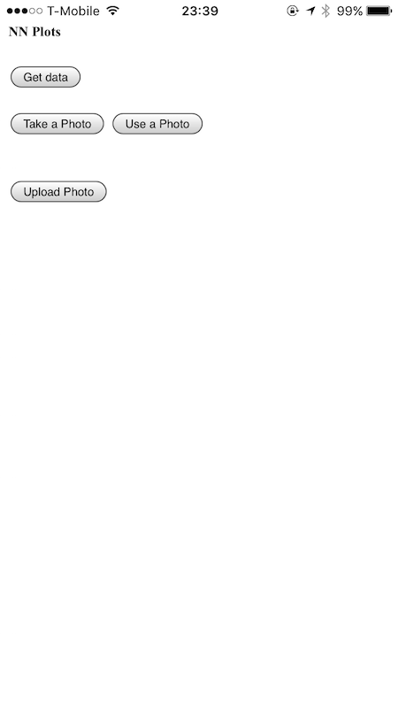

# NN Plots

I've been playing with LSTM network for a week, wanting to explore possible creative outcomes using them. I trained a model on several different corpus and got very interesting results. I found that one of the most difficult parts is selecting the source text you want to use. So, while searching for an interesting data to use I came across [this corpus on story plots](https://github.com/markriedl/WikiPlots) which I'm very curious in using.

For my final, I want to create a mobile app where you can upload a set of different photos from your phone, and the app will create a plot for all the photos you uploaded. I'll be mixing image recongnition with keras and text generation with RNN.

I build a basic iOS app that can upload files to a python server and retrieve data from it.
In this current prototype, I can send a picture and use the resnet code from week5 to classify an image. The idea is that from the description of the image I will generate the plot of a story.

The screenshot of the prototype app doesn't look too cool, but it does its job:

