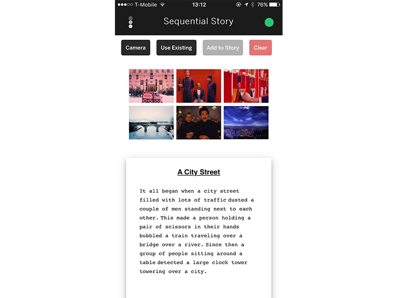
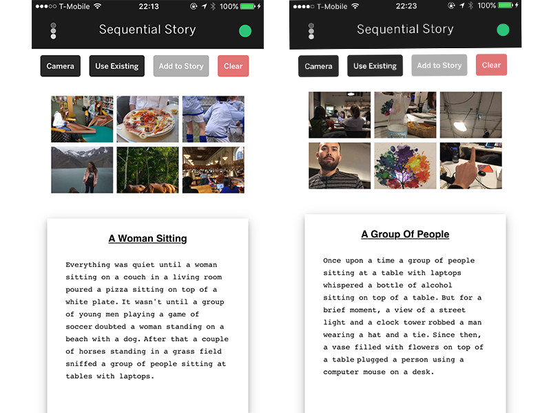
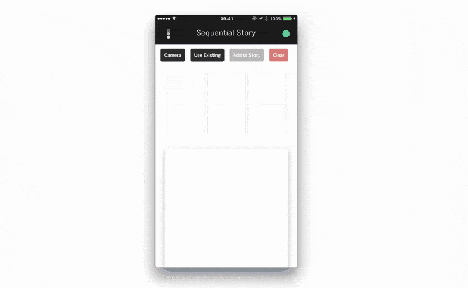

#  Sequential Stories

The <i>Show and Tell</i> model is a image-to-text model for Tensorflow, developed by Google DeepMind and based on this [paper](https://arxiv.org/abs/1609.06647), that takes an input and learns how to describe the content of images. This experimental iOS app uses this feature to generate a series of captions and create a story.

Example using stills from the 'The Gran Budapest Hotel' by Wes Anderson:



# Setup

This app queries a local server. Therefore, it is necessary to change the current IP in the `server_im2txt` file. That IP need to match the IP setup in the configuration button from the app.

To install im2txt and its dependencies, I followed [Edouard Fouché](https://edouardfouche.com/Fun-with-Tensorflow-im2txt/) setup and used the same pre trained model described in his instructions. The only change was that in line 49 in `im2txt/im2txt/inference_utils/vocabulary.py` I <b>didn't</b> change this:

```
reverse_vocab = [line.split()[0] for line in reverse_vocab] # to:
reverse_vocab = [eval(line.split()[0]).decode() for line in reverse_vocab]
```
Running a MacBook Pro from 2014 it takes around 7 seconds to caption an image.

Dependencies:
 - Bazel
 - TensorFlow 1.0 or greater
 - NumPy
 - Natural Language Toolkit (NLTK)
 - [Checkpoint](https://drive.google.com/file/d/0B_qCJ40uBfjEWVItOTdyNUFOMzg/view)

To run the app, open the `Sequential.xcodeproj` file located in `platforms/ios/` in Xcode and upload to an Iphone.

# Versions

The file `server_im2txt` runs the im2txt model on every request from to the `/upload` route and returns a string with a sentence for the story.
The app loads an image to the `/upload` folder.

The file `server_lstm` runs a classification model in keras and then a LSTM network trained on the 25 most download books from the Gutenberg Project. This was the first approach to the app and it's still a WIP.

# Outputs



### Interaction




# Links
- Original Model: [Show and Tell: A Neural Image Caption Generator](https://github.com/tensorflow/models/tree/master/im2txt)
- Paper: [Show and Tell: Lessons learned from the 2015 MSCOCO Image Captioning Challenge](https://arxiv.org/abs/1609.06647)
- Configuration: [Tensorflow - im2txt](https://edouardfouche.com/Fun-with-Tensorflow-im2txt/)

# TODO

-  ~~Configure IP from app.~~
- Create Reacte Native version?
- Add more nlp to the output or maybe add the lstm version to it?
